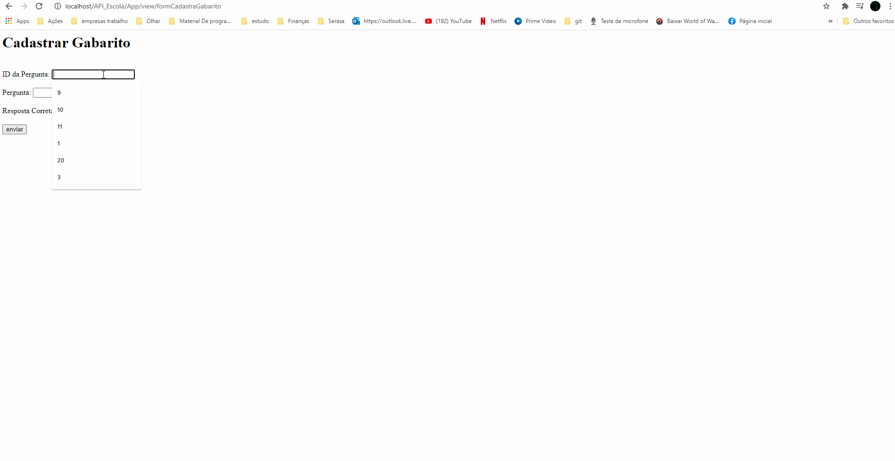
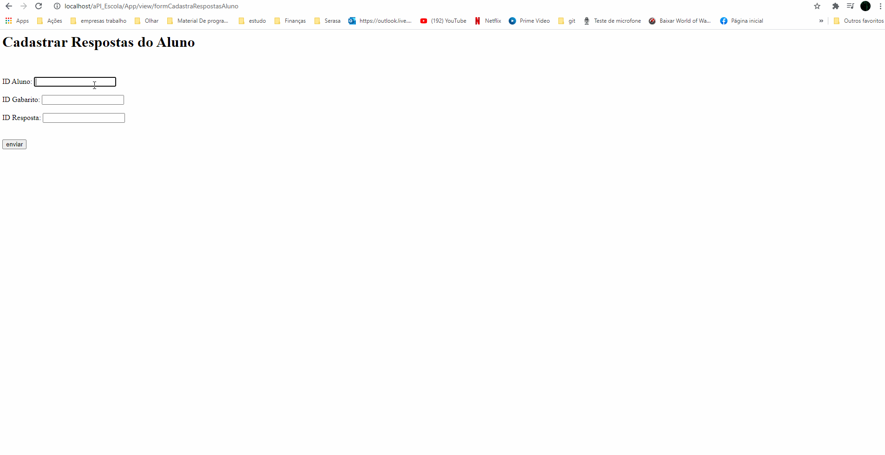
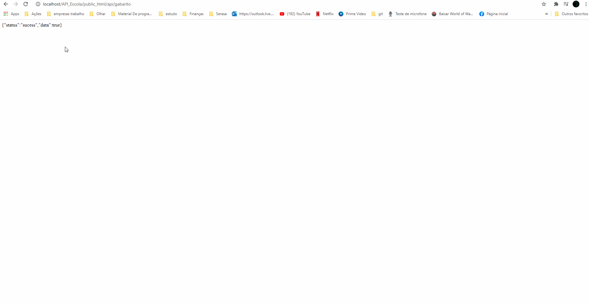
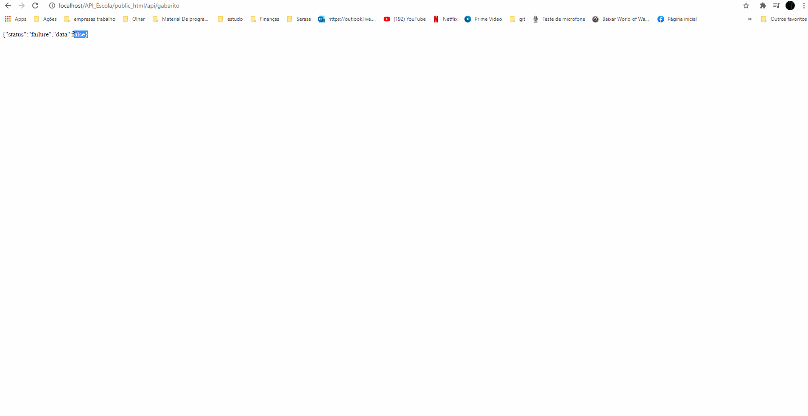

<h1 style = "text-align: center; font-weight: bold;"> API  Gabarito de Prova </h1>

##  Sobre o Projeto

Esta aplicação oferece uma API onde poderar estar cadastrando o gabarito das provas, e os gabaritos dos alunos.

### 🛠 Ferramentas Utilizadas

- [Composer](https://getcomposer.org/doc/)
- [Mysql](https://dev.mysql.com/doc/)
- [PHP](https://www.php.net/docs.php) 
- [WampServer](https://www.wampserver.com/en/)

### 🤔 Como Utilizar a API

- Faça o clone da pasta [API_Escola](https://github.com/BrunoBastos97/API_Escola) no github.
- Para Utilizar a API, é preciso ter um server, para isso obitenha o [WampServer](https://www.wampserver.com/en/) ou um outro da sua preferencia.
- Se utilizado o [WampServer](https://www.wampserver.com/en/), faça o clone da pasta [API_Escola](https://github.com/BrunoBastos97/API_Escola) no github, na pasta www no WampServer.
- Caso queira importe para o banco de dados Mysql o [banco.sql](https://github.com/BrunoBastos97/API_Escola/blob/main/banco.sql) , ou copie e cole em seguida aplique o mesmo.
- Confira os dados do banco no arquivo config.php.
- Para verificar a nota de todos os alunos [Verificar notas](http://localhost/API_escola/public_html/api/aluno) , utilize o link.
- Para verificar a nota de um determinado aluno exemplo aluno com o id 1 [Verificar nota do aluno](http://localhost/API_Escola/public_html/api/aluno/1) , utilize o link.
- Para verificar a nota dos alunos que foram aprovados [Verificar alunos aprovados](http://localhost/API_Escola/public_html/api/aluno/aprovados) , utilize o link.

O Gabarito tanto da prova quanto do aluno, poderam ser cadastrados nos forms. 
- [Cadastrar Gabarito](http://localhost/API_Escola/App/view/formCadastraGabarito)
- [Cadastrar Respostas do Aluno](http://localhost/API_Escola/App/view/formCadastraRespostasAluno) 

### ❌ Restrições da API/Bando de dados

- Não podera cadastrar mais de 10 questões na prova.
- Não podera cadastrar mais de 100 alunos.

### 👨‍🏫 Telas de Cadastro

#### Como Utilizar a tela [Cadastrar Gabarito](http://localhost/API_Escola/App/view/formCadastraGabarito)

        

#### Como Utilizar a tela [Cadastrar Respostas do Aluno](http://localhost/API_Escola/App/view/formCadastraRespostasAluno) 

        

### 🕵️‍♂️ Testes Unitários 

- Para fazer os testes unitários acesse [Testes](http://localhost/API_Escola/App/view/formTeste.php)  
- As informações já vão está preenchidas

        
    

